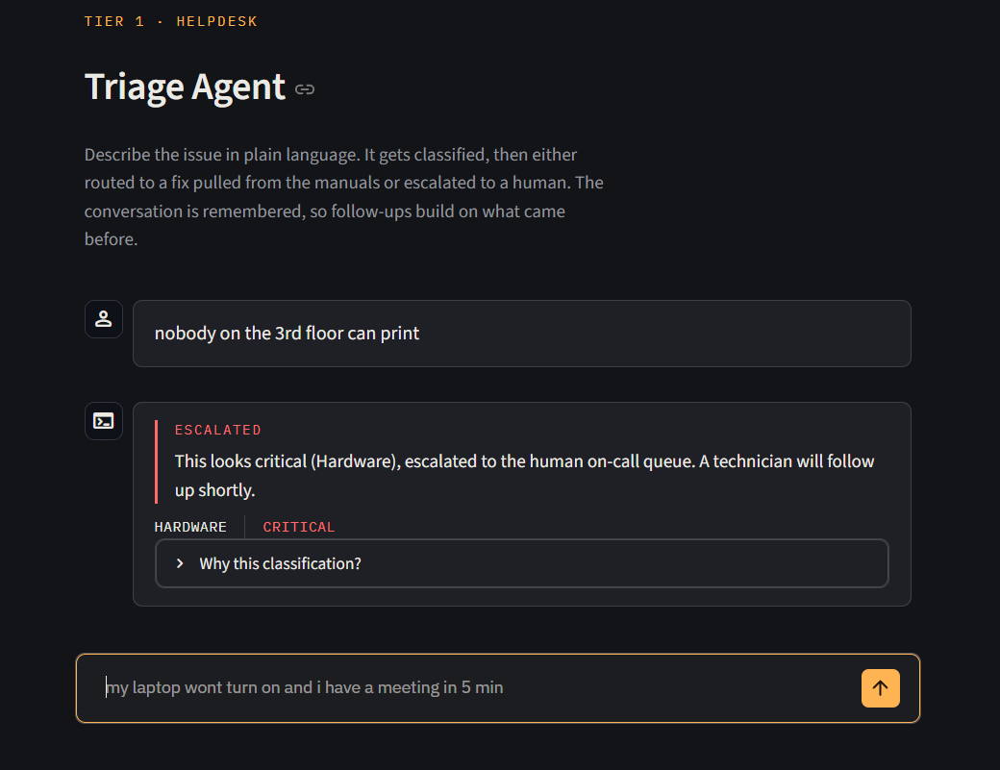
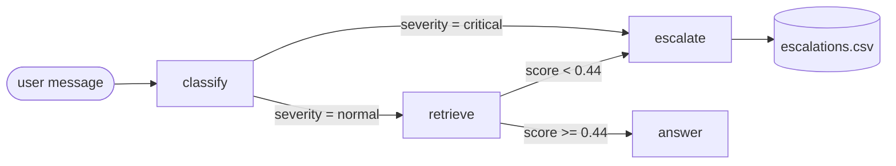

# IT Helpdesk Triage & Routing Agent

A LangGraph agent that triages IT tickets like a Tier 1 technician: it
classifies the issue, decides whether to solve it or hand it to a human, and
answers from a vector-searched manual only when it is confident enough to be
useful.

The point of the project is the **routing decision**, not the chat. A generic
RAG pipeline forces every question through retrieval and answers whatever comes
back. This one takes a different path depending on what it is looking at, and
refuses to answer when the manuals do not actually cover the question.

<!--
SCREENSHOT: drop a PNG at docs/screenshot.png and uncomment the line below.
Capture a conversation showing one answered issue and one escalation, so both
panel styles and the confidence tag are visible.


-->

## What this demonstrates

- **Conditional routing.** Two decision points, not one: ticket severity picks
  the first branch, retrieval confidence picks the second.
- **Knowing when to refuse.** A weak vector match escalates to a human instead
  of letting the model improvise an answer from irrelevant context.
- **Measured, not asserted.** Two eval harnesses. The escalation threshold was
  calibrated from labelled data rather than picked by eye: `0.44` routes 23/23
  cases, while the hand-guessed `0.5` it replaced scored 22/23.
- **Conversation state that survives a restart**, with the design constraint
  that forces (see [Conversation persistence](#conversation-persistence)).

Known failure modes are documented below rather than omitted.

## How it routes



Both branches end in a reply to the user; escalations also append a row to the
queue log.

## Stack

| | |
|---|---|
| Orchestration | LangGraph (`StateGraph`, conditional edges, `SqliteSaver`) |
| LLM | `qwen2.5` via Ollama locally, or `gpt-4o-mini` when deployed |
| Embeddings | OpenAI `text-embedding-3-small` |
| Vector store | Pinecone (serverless, filtered by predicted category) |
| UI | Streamlit |

The manual corpus is **12 synthetic snippets** across Hardware, Network and
Account, written for this demo. It is not a real knowledge base.

## Results

**Classifier** (`python eval_classifier.py`, 19 labelled tickets):

| | `qwen2.5` (local) | `gpt-4o-mini` (hosted) |
|---|---|---|
| category | 18/19 | 18/19 |
| severity | 18/19 | 19/19 |

Both models miss the same case, and it is a genuine judgement call left failing
as a marker rather than relabelled to flatter the score: *"attacker has admin
access to the domain controller"* is labelled `Account`, both models say
`Network`. Severity is `critical` either way, so routing is unaffected.

The local model additionally calls *"nobody on the 3rd floor can print"*
`normal` where the label says `critical`; it appears to weigh printing as
low-stakes regardless of scope, which is defensible. `gpt-4o-mini` gets it.

**Retrieval threshold** (`python eval_retrieval.py`, 23 labelled queries):

```
answerable    min 0.459  max 0.716
unanswerable  min 0.075  max 0.418
clean separation, gap 0.041
```

Answerable queries never scored below 0.459 and unanswerable ones never above
0.418, so `0.44` sits in the middle of that gap. The gap is narrow, and this is
23 hand-written cases against a 12-snippet corpus: re-run the script after
changing the embedding model or loading real manuals rather than assuming the
number transfers.

## Design notes

**Multi-turn handling.** The classifier reads the last 5 messages, so a
follow-up like "that didn't work" is classified against the original issue
rather than in isolation. Retrieval builds its query from the last 3 *user*
turns for the same reason: a bare follow-up carries no topic words, and
embedding it alone scored 0.28 and escalated a question the manuals answered.
Assistant replies are excluded from that query because they already quote the
manuals, which would bias retrieval toward whatever was answered last.

Combining turns dilutes the embedding slightly (a single-turn query scored
0.592, the combined one 0.532), which is why the calibrated threshold matters.

<a name="conversation-persistence"></a>
**Conversation persistence.** State is checkpointed to `checkpoints.sqlite`, so
conversations survive an app restart. The thread id lives in the URL
(`?thread=<uuid>`) rather than `st.session_state`, because session state is
wiped when the server restarts, which would orphan the very conversations the
database exists to reopen. Per-turn metadata (category, severity, confidence,
escalation flag) is stored on each reply's `additional_kwargs`, so a restored
conversation still shows the tags it displayed originally.

## Running it

1. Install [Ollama](https://ollama.com) and pull the model. It must be running
   before you start the app.
   ```bash
   ollama pull qwen2.5
   ```

2. Install dependencies:
   ```bash
   pip install -r requirements.txt
   ```

3. Copy `.env.example` to `.env` and add your `OPENAI_API_KEY` (embeddings) and
   `PINECONE_API_KEY`.

4. Load the manual snippets into Pinecone. Run once, or again after editing
   `manuals.py`:
   ```bash
   python ingest.py
   ```

5. Start the app:
   ```bash
   python -m streamlit run app.py
   ```

Try `"my keyboard keys are sticking"` for the answer path, `"the production
server room caught fire"` for severity escalation, and `"my desk chair squeaks"`
for the low-confidence escalation. Escalations append to `escalations.csv`.

## Deploying

The agent runs on a local model by default, which needs hardware a free host
does not have. Set `LLM_PROVIDER=openai` and it uses `gpt-4o-mini` instead;
embeddings and the vector store are unchanged, so the calibrated retrieval
threshold still applies.

On [Streamlit Community Cloud](https://share.streamlit.io), point it at
`app.py` and add these under **Secrets**:

```toml
OPENAI_API_KEY = "sk-..."
PINECONE_API_KEY = "pcsk_..."
PINECONE_INDEX = "it-helpdesk-manuals"
LLM_PROVIDER = "openai"
```

Run `python ingest.py` locally once beforehand; the deployed app reads the
Pinecone index but does not populate it.

Two things to know about a public deployment. Its filesystem is ephemeral, so
`checkpoints.sqlite` and `escalations.csv` reset when the app sleeps or
redeploys, and conversation links stop resolving. And every visitor spends your
OpenAI credit, so set a usage limit on the API key rather than leaving it
uncapped.

## Limitations

- The manual corpus is synthetic and small; retrieval quality reflects that.
- The escalation queue is a CSV file, not a ticketing system.
- Classification runs on a small local model, so it is sensitive to phrasing.
  Adding an implied-scope rule to the prompt fixed "network down in the
  marketing department" being treated as a single-user issue, but similar gaps
  likely remain.
- No auth, no rate limiting, single tenant. It is a demonstration, not a
  production service.
- Deployed on a free host, conversation state does not survive the app
  sleeping, since the filesystem is ephemeral.
